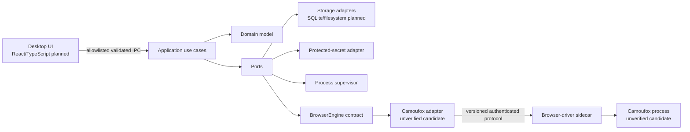

# Architecture

## Status and evidence boundary

This is the target architecture agreed for planning. It does not assert that Camoufox can yet satisfy the engine contract. All Camoufox-specific feasibility questions remain open in the [Audit Register](AUDIT_REGISTER.md).

## Architectural style

The application uses a modular ports-and-adapters architecture. Domain and application policies sit inside the system boundary; desktop UI, persistence, keychain, filesystem, browser engines, automation libraries, and operating-system facilities are replaceable adapters.

The named technologies are planned choices recorded in ADRs; they are not scaffolded in Phase 1.

## Dependency rule

Dependencies point inward:

- `domain` depends on no UI, storage, framework, automation, engine, or filesystem implementation.
- `application` depends on domain types and abstract ports.
- adapters implement ports and may depend on external technology.
- composition roots may know concrete implementations; feature modules may not bypass contracts.

The domain must never branch on `camoufox` or `chromium`. Differences are represented by declared capabilities and typed failure results.

## Primary runtime boundaries

| Boundary | Data crossing it | Control |
|---|---|---|
| WebView → Rust Core | Validated commands and presentation-safe results | Allowlisted Tauri commands; schema validation; no raw SQL or shell |
| Rust Core → sidecar | Versioned requests, non-secret handles, lifecycle context | Authenticated local channel, protocol negotiation, correlation IDs |
| Rust Core → keychain | Secret values and stable lookup identifiers | Least privilege; values never returned to UI |
| Rust Core → storage | Domain records, manifests, journals, snapshot metadata | Repository ports and transactions |
| Sidecar → browser | Launch configuration and automation commands | Sidecar invokes the launcher; no secrets in argv; one supervised tree per profile |
| Local API → application | Authenticated automation requests | Loopback by default, scoped token, rate/operation controls |
| Updater → core store | Versioned artifacts and provenance metadata | Checksum/signature verification and anti-downgrade policy |

The Rust-side process supervisor is authoritative for the supervised sidecar/browser tree; the sidecar owns the launcher and automation session. Protocol transport, concrete Windows containment, sidecar language, and Camoufox launch semantics are deliberately unresolved (`AUD-012`, `AUD-024`). See [SIDECAR_PROCESS_MODEL.md](SIDECAR_PROCESS_MODEL.md) and [ADR-0012](adr/0012-supervised-sidecar-process-ownership.md).

The local API enablement default is not yet accepted (`DEC-API-001`). Regardless of that choice, loopback is not treated as authentication. [Threat Model](THREAT_MODEL.md) owns the trust-boundary analysis.

## Aggregates and ownership

- **Profile aggregate:** references to immutable identity, mutable runtime configuration, accepted baselines, state, lock, and lifecycle rules; it is the proposed owner of the only mutable `activeCoreId` and its activation generation.
- **Identity manifest:** canonical immutable identity inputs, protected-secret reference, derivation metadata, and integrity information.
- **Runtime configuration:** mutable proxy, approved extension, startup, and other non-identity launch choices.
- **Fingerprint baseline:** normalized observations for a versioned engine/core/probe/environment tuple.
- **Compatibility record:** immutable result for a proposed launch, migration, restore, or import.
- **Browser-core installation:** immutable installed artifact plus verification and compatibility status.
- **Snapshot:** immutable recovery point linked to a profile checkpoint.
- **Operation:** correlated durable record for long-running start, stop, migration, import, export, and recovery work.

Detailed ownership is in [MODULE_BOUNDARIES.md](MODULE_BOUNDARIES.md), authoritative data ownership in [DATA_AUTHORITY.md](DATA_AUTHORITY.md), and persistence in [STORAGE_MODEL.md](STORAGE_MODEL.md). The active-core clarification remains proposed in [ADR-0015](adr/0015-profile-owned-active-core-pointer.md); no competing mutable pointer may be introduced while it is pending.

These record classes are separated by [ADR-0014](adr/0014-separate-identity-runtime-and-observation-records.md); a mutable core or proxy choice is never stored as immutable identity truth.

## Key invariants

- `profileId`, `engineId`, and `profileSecret` never change for an existing profile.
- A profile has exactly one dedicated user data directory and may have at most one active process tree.
- A successful stop/start does not regenerate identity seeds.
- No two profiles share mutable browser state or secret-derived seed material.
- An engine operation is allowed only when the adapter reports the required capabilities.
- A profile becomes `RUNNING` only after lock acquisition, integrity checks, successful launch, and fingerprint preflight.
- A failed preflight never silently accepts a new baseline.
- A browser-core migration is transactional at the application level and retains a rollback target.
- Snapshots are created only at a verified checkpoint.
- Sensitive values never cross into UI models, command-line arguments, normal logs, or diagnostic bundles.

## Failure model

Every cross-process request has an operation ID, deadline, cancellation behavior, and typed result. Uncertain outcomes are not treated as success. After a timeout or crash, the supervisor reconciles process state, the application consults the event journal, and the profile remains locked or quarantined until safety is established. [Operations Model](OPERATIONS_MODEL.md) owns these semantics.

Failures are classified as:

- validation or policy rejection;
- capability unavailable;
- integrity or provenance failure;
- transient process/IO failure;
- uncertain commit requiring reconciliation;
- fingerprint incompatibility;
- security boundary violation.

## Extensibility

A future Chromium adapter must implement the same behavioral contract but may expose a different capability set. An engine change creates a new profile. Only explicitly portable data may be copied; the existing identity is not reinterpreted as another engine's identity. See [ADR-0003](adr/0003-browser-engine-adapter.md) and [ADR-0007](adr/0007-immutable-engine-binding.md).

## Planned technologies

- Desktop shell: Tauri.
- System/core layer: Rust.
- UI: React, TypeScript, and Vite.
- Metadata: SQLite accessed only through Rust-side storage ports.
- Secrets: OS keychain and Rust-side cryptography.
- Automation: Playwright behind the browser-driver sidecar.
- First adapter: Camoufox, conditional on Phase 1 evidence.

Selection of TypeScript or Python for the sidecar is deferred to `AUD-012`; transport and recovery semantics are deferred to `AUD-024`.
