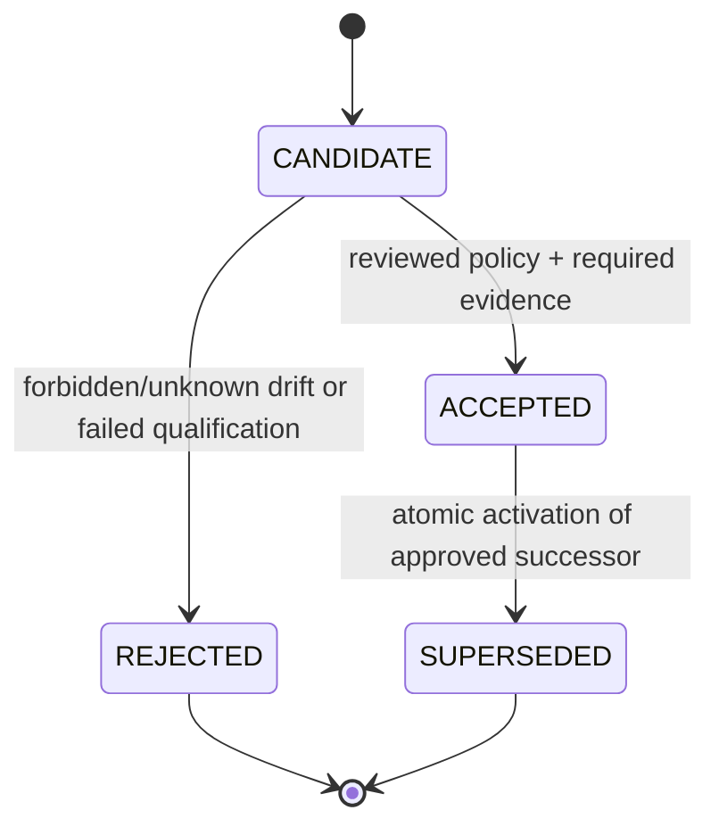

# Fingerprint and Preflight Specification

- Status: Proposed; surface support and tolerances are unverified
- Owner: Identity verification
- Last reviewed: 2026-09-28
- Review trigger: Probe schema, upstream lock, environment matrix, or baseline policy change

## Evidence boundary

This specification defines classification, record shape, and decision flow. It does not assert that Camoufox controls or exposes any particular surface. Surface rows become supported only through `AUD-001`–`AUD-003`, `AUD-006`, `AUD-007`, `AUD-019`, `AUD-022`, and the new focused audits.

## Surface catalogue structure

Each surface entry records:

| Field | Meaning |
|---|---|
| `surfaceId` | Stable identifier, never reused |
| configured input | Manifest/derived/host/runtime input intended to influence it |
| observed values | Normalized probe fields per execution context |
| class | immutable, version-derived, render-derived, host-dependent, network-derived, or informational |
| contexts | main frame, same/cross-origin iframe, dedicated/shared/service worker, worklet, network/native probe |
| source coverage | Pinned files/symbols/config consumers |
| normalization rule | Versioned transformation before comparison |
| semantic rule | invariant, allowed set/range, environment-qualified, informational, forbidden-to-change |
| revalidation triggers | Events that may invalidate acceptance |
| audit/evidence | Audit and evidence IDs supporting the rule |
| blind spots | Unobserved or confounded behavior |

Configured values, engine-rendered configuration, observed values, and accepted expectations are separate records. An observed value never rewrites its configured input.

## Classification

- **Immutable identity material:** profile secret reference, derivation namespace, engine binding, and semantic identity inputs that cannot change for a profile.
- **Version-derived configuration:** deterministic rendering of the same identity for a schema/dataset/adapter/core; changes require compatibility rules.
- **Render-derived observation:** measured output affected by rendering implementation and possibly environment.
- **Host-dependent observation:** depends on OS, hardware, driver, fonts, display, media devices, clocks, or power/session state.
- **Network-derived observation:** headers, TLS/HTTP behavior, egress/DNS/WebRTC, geolocation/locale/timezone coherence.
- **Informational:** useful for diagnosis but not an acceptance criterion unless promoted with evidence.

## Probe contexts and coverage

Minimum catalogue contexts are main frame, applicable same/cross-origin iframe, dedicated worker, shared worker, service worker, applicable worklet, browser/native metadata, and controlled network observation. Unsupported contexts are explicit capabilities, not silently omitted passes.

The coverage map links every configured identity field and relevant patch/config consumer to one or more observations or a documented blind spot. Mutation tests deliberately change one controlled input and prove the expected probes/diffs respond without unrelated acceptance.

## Normalization and semantic diff

Normalization is versioned, deterministic, loss-documented, and applied before policy comparison. It may canonicalize ordering, numeric representation, units, or environment descriptors; it cannot erase a security-relevant difference merely to make a test pass.

Diff classes are:

| Class | Meaning | Default action |
|---|---|---|
| `EXPECTED` | Evidence-backed version/environment change within an approved rule | Permit only for matching rule context |
| `REVIEW_REQUIRED` | Bounded but not auto-approved difference | Hold launch/migration for policy decision |
| `FORBIDDEN` | Immutable drift, missing mandatory field, contradiction, unapproved network/host change | Stop/quarantine/rollback |
| `UNKNOWN` | No applicable rule or insufficient observation | Fail closed for required surface |

Raw aggregate hash equality may be recorded as a diagnostic shortcut but is never the only acceptance criterion.

## Baseline lifecycle

- `CANDIDATE` is immutable probe output awaiting comparison/decision.
- `ACCEPTED` is the sole baseline referenced for one active core/probe/environment policy tuple.
- `REJECTED` remains diagnostic evidence and is never auto-promoted.
- `SUPERSEDED` remains historical evidence/rollback context.
- A failed start, drift, or missing baseline cannot overwrite an accepted baseline.

## Preflight timing and navigation cage

Preflight runs after the browser tree is verified and engine communication is available, but before `RUNNING`, external navigation, restored external tabs, page scripts from prior sessions, or automation leases are permitted. In `LAUNCHED_UNVERIFIED`, only controlled local probe resources and engine-internal operations explicitly required by the approved probe may run. Feasibility—including extension/service-worker/background traffic suppression—is an `AUD-032` question.

The accepted result binds a profile/config/core/baseline/environment generation. A material change between observation and release invalidates the result.

## Revalidation triggers

| Trigger | Proposed response | Evidence gate |
|---|---|---|
| Core migration or rollback | Full qualification/preflight; new candidate baseline | `AUD-009`, `AUD-020`, `AUD-032` |
| Proxy assignment/endpoint change | Network/coherence preflight; full probe if policy couples locale/timezone/geolocation | `AUD-008`, `AUD-027`, `AUD-028` |
| Display/DPI/zoom/monitor topology change | Pause protected navigation; host/display subset then full comparison if changed | `AUD-029`, `AUD-032` |
| GPU process restart/driver change | GPU/WebGL subset; quarantine or relaunch on forbidden/unknown change | `AUD-007`, `AUD-029`, `AUD-032` |
| Media-device/permission change | Media subset and coherence policy | `AUD-030`, `AUD-032` |
| Extension install/update/enable/disable | Extension/fingerprint/security subset; full probe where impact unknown | `AUD-011`, `AUD-032` |
| Sleep/resume, user-session or power-display transition | Environment generation check and impacted subset before continuing | `AUD-022`, `AUD-029`, `AUD-032` |
| Snapshot restore, Backup/Transfer import | Full integrity/compatibility/preflight; imported baseline is not auto-accepted | `AUD-010`, `AUD-021`, `AUD-026`, `AUD-032` |

Until evidence defines a safe narrower subset, the conservative response is to pause external activity and run the full required preflight.

## Known blind spots

Potential blind spots include native/browser-internal state not exposed to page probes, TLS implementation details, timing/power noise, font rasterization, GPU process replacement, service-worker/background requests before gating, extension behavior, media permission persistence, and same-user tampering. Each is either mapped to an audit or explicitly outside the assurance claim.

