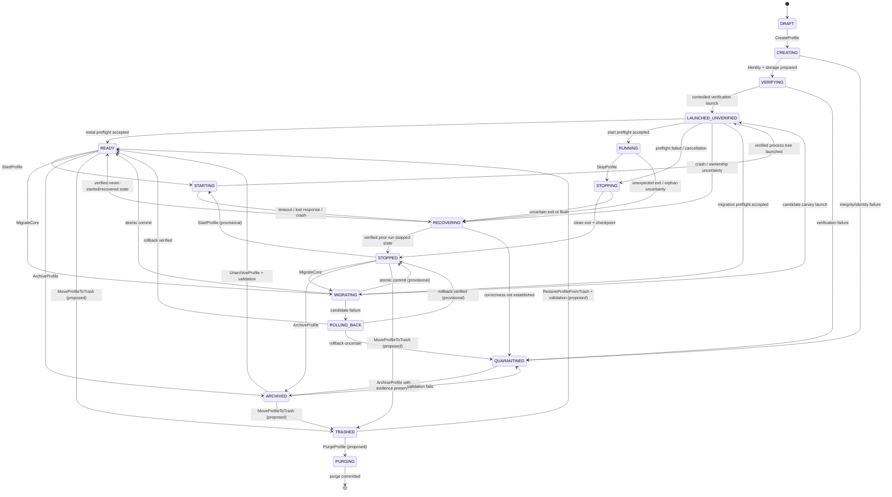

# Profile Lifecycle

- Status: Accepted safety invariants; steady-state and delete vocabulary are Proposed
- Owner: Profile/application lifecycle
- Last reviewed: 2026-09-28
- Review trigger: `DEC-LIFECYCLE-001`, `DEC-PROFILE-001`, or sidecar protocol decision

## State model

`LAUNCHED_UNVERIFIED` is mandatory whenever a browser tree exists but required preflight has not passed for the current core/config/environment generation. It is never user-browsing-ready.

`TRASHED`, `PURGING`, and the single-state recommendation are pending `DEC-PROFILE-001`/`DEC-LIFECYCLE-001`; they must not be implemented as Accepted behavior until approved.

## State semantics

| State | Browser tree | User navigation / automation | Meaning |
|---|---|---|---|
| `DRAFT` | none | forbidden | Request not yet materialized as a profile |
| `CREATING` | none | forbidden | IDs, secret, manifest and storage are being prepared |
| `VERIFYING` | none unless entering controlled launch | forbidden | Initial integrity/capability checks |
| `STARTING` | none or outcome uncertain | forbidden | Lock held; process effect not yet verified |
| `LAUNCHED_UNVERIFIED` | exactly one verified/being-reconciled tree | forbidden except controlled local probe | Browser launched; preflight not accepted |
| `RUNNING` | exactly one verified tree | permitted within policy | Preflight passed for the current environment generation |
| `STOPPING` | may exist | new navigation/leases forbidden | Graceful close/checkpoint in progress |
| `RECOVERING` | unknown until reconciled | forbidden | Outcome/process/storage correctness uncertain |
| `QUARANTINED` | none after safe containment, or explicitly tracked orphan | forbidden | Integrity/compatibility cannot be established |
| `MIGRATING` / `ROLLING_BACK` | controlled candidate tree may exist | external navigation/automation forbidden | Core/baseline transition operation |
| `ARCHIVED` | none | forbidden | Retained but intentionally unavailable for start |
| `TRASHED` / `PURGING` | none | forbidden | Proposed deletion retention/finalization states |

## `READY` versus `STOPPED`

Current documents use both:

- Provisional `READY`: identity/storage are verified and no browser tree exists; commonly reached after create/import/recovery.
- Provisional `STOPPED`: a previously running profile completed a clean stop/checkpoint and no tree exists.

Both require current start-time validation, so the behavioral distinction is weak. [ADR-0017](adr/0017-launchable-steady-state.md) recommends one launchable `READY` state plus `lastStopDisposition`. Until approved, implementations must not invent different security privileges for `READY` and `STOPPED`; Phase 2 schema generation is blocked on the decision.

## Formal transition table

| From | Command/event | Guard | To | Failure/uncertain behavior |
|---|---|---|---|---|
| `DRAFT` | `CreateProfile` | request/capabilities/preset valid | `CREATING` | reject before effect |
| `CREATING` | identity/storage prepared | immutable IDs reserved, secret protected, atomic manifest valid | `VERIFYING` | clean owned partial resources or quarantine uncertain identity state |
| `VERIFYING` | controlled launch | core/manifest/path/lock valid | `LAUNCHED_UNVERIFIED` | quarantine/recover; never randomize replacement identity |
| `READY`/`STOPPED` | `StartProfile` | exclusive lock, no incomplete op/tree, qualified core/config | `STARTING` | typed rejection or `RECOVERING` if effect may have begun |
| `STARTING` | verified launch event | exact tree ownership recorded | `LAUNCHED_UNVERIFIED` | lost response → `RECOVERING`; no blind retry |
| `LAUNCHED_UNVERIFIED` | preflight pass | mandatory contexts complete; semantic diff allowed; environment generation unchanged | `RUNNING` or migration commit path | fail/unknown → contain tree and recover/quarantine; no baseline auto-accept |
| `RUNNING` | `StopProfile` | lock retained; new mutations/leases blocked | `STOPPING` | timeout/sidecar loss → `RECOVERING` |
| `STOPPING` | exit + checkpoint verified | owned tree exited and durable state disposition recorded | `STOPPED`/future `READY` | forced/uncertain flush → `RECOVERING` |
| transient/running | crash/timeout/orphan | effect or liveness uncertain | `RECOVERING` | keep lock; inspect authority/journal/tree before action |
| `RECOVERING` | reconcile | one safe state proven | `READY`, `STOPPED`, or `QUARANTINED` | unknown ownership/integrity → `QUARANTINED` |
| `READY`/`STOPPED` | `MigrateCore` | lock, verified recovery point, qualified candidate | `MIGRATING` | old active pair remains authoritative |
| `MIGRATING` | commit | candidate preflight approved; core/baseline pair transaction succeeds | prior steady-state vocabulary | mixed/unknown commit → reconcile/quarantine |
| inactive state | archive/unarchive/delete/purge command | no tree or mutating operation; policy-specific retention satisfied | policy state | uncertain filesystem/metadata outcome → reconcile; never report purge early |

## Preflight cage and TOCTOU

Before preflight passes, the browser may load only controlled local probe resources and perform explicitly approved engine-internal checks. It may not:

- navigate to an external site;
- restore external tabs/windows/session history;
- receive an automation lease;
- start Cookie Bot/sync work;
- resume background extension/service-worker network activity unless the approved probe design proves it contained.

Material environment/config changes invalidate the accepted preflight generation. Revalidation triggers and baseline lifecycle are normative in [FINGERPRINT_SPEC.md](FINGERPRINT_SPEC.md); enforcement feasibility is `AUD-032`.

## Create

1. Validate request and engine capabilities.
2. Reserve identifiers and filesystem location.
3. Select a coherent device preset.
4. Create/protect `profileSecret`; derive versioned values.
5. Write an integrity-protected immutable identity manifest.
6. Create the dedicated data directory.
7. Perform a caged verification launch in `LAUNCHED_UNVERIFIED` and collect a candidate baseline.
8. Commit launchable state only when integrity, coverage, and semantic policy pass.

On failure, clean only resources proven to belong to the operation. Preserve diagnostic evidence. Uncertain secret/manifest state is quarantined, never regenerated in place.

## Start and stop

Start follows the formal table, [OPERATIONS_MODEL.md](OPERATIONS_MODEL.md), and [SIDECAR_PROCESS_MODEL.md](SIDECAR_PROCESS_MODEL.md). A successful engine launch is not a successful profile Start until process ownership and preflight pass.

Stop blocks new mutations/leases, requests graceful browser close, independently observes tree exit, records checkpoint confidence, completes any phase-appropriate recovery checkpoint, commits metadata/journal state, and only then releases the lock. Forced termination records recovery-required risk.

## Crash, timeout, and orphan rules

- A timeout after a possible effect is `OUTCOME_UNKNOWN`, not a clean failure.
- Sidecar-dead/browser-live keeps the profile locked; adopt/terminate only after `AUD-024`-approved ownership verification.
- Browser-dead/sidecar-live records exit evidence and tears down/reconciles the session.
- An unverified process is neither killed nor adopted from PID alone.
- A crash never generates a new identity or silently accepts a baseline.
- External navigation/automation remains disabled during reconciliation.

## Catalogue retention operations

Use explicit verbs; bare “restore” is forbidden in APIs, requirements, and UX:

| Operation | Meaning | Identity effect | Current decision status |
|---|---|---|---|
| `ArchiveProfile` | Hide/disable start while retaining all data | none | Existing planned capability |
| `UnarchiveProfile` | Re-enable after integrity/current-compatibility validation | none | Existing planned capability |
| `MoveProfileToTrash` | Proposed soft delete with retention/tombstone | none | Pending `DEC-PROFILE-001` |
| `RestoreProfileFromTrash` | Undo soft delete before purge and revalidate | none | Pending `DEC-PROFILE-001` |
| `PurgeProfile` | Irreversible journaled removal after retention/key/snapshot policy | deletes identity/state locally | Pending `DEC-PROFILE-001`; explicit confirmation required |
| `RestoreSnapshotSameProfile` | Replace/recover state for the same profile from a verified snapshot | preserves identity | Phase 3; staged/rollback-safe |
| `ImportBackupAsIdentity` | Import an absent identity into a catalogue | preserves container identity | Phase 3; compatibility/preflight required |
| `ReplaceProfileFromBackup` | Explicit staged replacement when the same `profileId` exists | preserves existing identity | ADR-0013; rollback-safe |
| `DuplicateAsNewProfile` | Create a new profile and copy only approved data/config | new ID/secret/identity | ADR-0009 |
| `RollbackCore` | Return active core/baseline/data through an approved rollback path | identity preserved | ADR-0008; `AUD-020` |

Archive/trash/purge may run only with no owned tree and no conflicting operation. Purge records exactly what was removed, key deletion outcome, retained legal/audit tombstone, and whether recovery is possible; uncertain deletion remains an operation requiring reconciliation.
