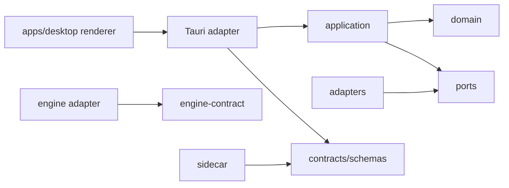

# Target Repository Layout

- Status: Proposed
- Owner: Architecture
- Last reviewed: 2026-09-28
- Review trigger: Phase 1 GO/CONDITIONAL GO and Phase 2 scaffold approval

## Purpose

This is the target modular layout for Phase 2. It does not authorize creating production directories or selecting package boundaries before the Phase 1 gate.

```text
apps/
  desktop/                 # Tauri composition root and renderer adapter
crates/
  domain/                  # Pure entities, invariants, value objects
  application/             # Use cases and abstract ports
  engine-contract/         # Language-neutral engine contract model
  operations/              # Journaling, locking, reconciliation policy
adapters/
  persistence-sqlite/      # Planned metadata adapter
  filesystem-windows/      # Paths, atomic writes, reparse-point defense
  keychain-windows/        # Protected-store adapter
  process-windows/         # Process/job and resource observation adapter
  engine-camoufox/         # Candidate adapter after Phase 1 GO
sidecars/
  browser-driver/          # Selected TS or Python implementation after AUD-012/AUD-024
contracts/
  schemas/                 # Authoritative draft/accepted wire schemas
  generated/               # Future generated bindings; do not hand-edit
tests/
  contract/                # Engine/protocol conformance
  integration/             # Adapter and storage integration
  e2e/                     # Packaged desktop journeys
  fixtures/                # Synthetic application fixtures only
research/
  camoufox/                # Audit plans, locks, evidence indexes, experiments
tools/
  contract-generation/     # Future deterministic binding generation
scripts/
  docs-check.ps1           # Documentation/schema validation entry point
audit/
  schema.json              # Proposed machine-readable audit item schema
docs/                      # Human-owned specifications, ADRs, phase plans
```

Only `contracts/`, `research/`, `audit/`, `scripts/`, and documentation are created during this task.

## Ownership and public APIs

| Area | Owns | Public API | Must not depend on |
|---|---|---|---|
| `crates/domain` | entities, invariants, transition rules, typed domain errors | domain types and pure policies | Tauri, SQLite, filesystem, Playwright, Camoufox, Chromium |
| `crates/application` | use-case orchestration, ports, transaction/retry policy | use-case commands/results and port traits | concrete adapters or renderer types |
| `crates/engine-contract` | capabilities and engine operation models | versioned contract types | a named engine implementation |
| `crates/operations` | operation journal model, idempotency, reconciliation policy | operation/reconciliation services | UI or engine-specific launch code |
| `adapters/*` | technology-specific port implementations | only the port implemented | another adapter's internals |
| `adapters/engine-camoufox` | verified Camoufox translation | engine contract implementation | profile repository implementation or product policy |
| `sidecars/browser-driver` | protocol endpoint, launcher/Playwright session | versioned schemas in `contracts/` | database writes, lifecycle decisions, keychain authority |
| `apps/desktop` | composition, Tauri handlers, renderer presentation | allowlisted UI commands | direct renderer access to adapters/secrets |

## Allowed dependency direction



Dependencies point inward. Composition roots may know concrete adapters; feature modules may not deep-import them.

## Forbidden dependencies

- Renderer → database, filesystem, shell, process, keychain, or raw sidecar.
- Domain/application → Tauri, SQLite, Playwright, Camoufox, Chromium, or Windows APIs.
- Engine adapter → profile repository implementation or UI.
- Sidecar → application database, baseline acceptance, profile locks, or arbitrary keychain lookup.
- Persistence adapter → lifecycle or migration decisions.
- Test fixture → real user profile, credential, cookie database, or browser binary.

## Composition roots and contract generation

The desktop binary and the sidecar executable have separate composition roots. Only those roots select concrete adapters. JSON Schemas in `contracts/schemas` are the language-neutral contract source; future Rust/TypeScript/Python bindings are generated into explicit `generated/` directories and checked for synchronization.

## Test placement

- Pure invariant tests sit beside domain/application modules.
- Contract tests live under `tests/contract` and run against every engine/sidecar adapter.
- Integration tests own disposable adapter fixtures under `tests/integration`.
- Packaged UI journeys live under `tests/e2e`.
- Audit experiments remain under `research/camoufox/experiments` and do not become product tests until promoted with evidence and ownership.
- Architecture-boundary tests must detect forbidden imports and direct framework/adapter dependencies before Phase 2 exit.

