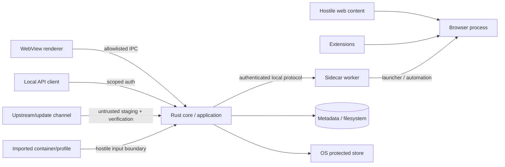

# Threat Model

- Status: Proposed; controls require implementation and test evidence
- Owner: Security
- Last reviewed: 2026-09-28
- Review trigger: New trust boundary, transport, updater, portability format, or release channel

## Scope and attacker assumptions

The initial product is a local, single-user Windows desktop application. It protects browser-profile identity/state from accidental mixing, hostile web content, malformed local inputs, and less-trusted renderer/sidecar components. It does not claim to withstand a fully compromised administrator/kernel or malware running as the same user with unrestricted memory/debug/file access.

The same-user limitation must be explicit: ACLs, keychain storage, loopback binding, and process isolation reduce accidental/cross-user exposure but may not stop a malicious process already executing with equivalent user authority. High-value secrets must still be minimized, scoped, and absent from logs/argv.

## Assets

- `profileSecret`, derived identity values, proxy/API/export credentials and key material.
- Cookies, authenticated sessions, local/IndexedDB state, saved logins, form data, extension data, history.
- Identity manifests, accepted baselines, compatibility and operation records.
- User data directories, snapshots, portability containers, core artifacts and update trust metadata.
- Sidecar/local API authority, process ownership handles/tokens, signing/release credentials.
- Diagnostic/evidence artifacts that may reveal environment or account state.

## Trust boundaries

The renderer, sidecar, browser content, extensions, imported containers, upstream metadata/artifacts, and local API clients are less trusted than application policy.

## Threat and control matrix

| Threat | Security objective / control owner | Required control | Verification reference |
|---|---|---|---|
| Renderer compromise invokes privileged behavior | Core/application | Allowlisted typed commands, schema/size validation, no raw SQL/path/shell/process/keychain APIs, presentation-safe results | `INV-002`, `AUD-033` |
| Sidecar endpoint hijacking or stale endpoint reuse | Process supervisor/security | Instance authentication, endpoint ownership/ACL, version negotiation, replay/idempotency defense, stale credential rejection | `SEC-002`, `AUD-024` |
| Named pipe/local transport ACL misconfiguration | Security/process adapter | Per-user/session endpoint, restrictive ACL, unpredictable non-secret locator plus authentication; exact primitive selected by spike | `AUD-024`, `AUD-034` |
| Same-user malicious process steals tokens or memory | Security | Minimize token lifetime/scope, protected storage, handle-based delivery, explicit residual-risk disclosure | `AUD-018`, `AUD-034` |
| DLL search-order, executable, or PATH hijacking | Process/core updater | Absolute verified paths, restricted working directory/environment, signed/hash-qualified binaries, safe DLL search policy | `AUD-016`, `AUD-031` |
| Junction/reparse/symlink/path traversal redirects writes | Filesystem/import-export adapters | Resolve/canonicalize under approved roots, reject unsafe reparse points, no archive traversal, race-resistant open/commit | `AUD-031`, Phase 3 hostile-input tests |
| Malicious profile/container causes parser/resource abuse | Import/export/snapshot | Authenticated bounded streaming, duplicate-path rejection, decompression limits, schema/version validation, staging and atomic commit | `REQ-PORTABILITY-001`, `SEC-004`, `AUD-021`, `AUD-026` |
| Browser content escapes or abuses automation | Browser/sidecar/application | Browser sandbox assumptions documented, bounded automation lease, navigation/download/upload policy, no core secret exposure | `AUD-018`, release security review |
| Malicious/overprivileged extension reads state or changes fingerprint | Extension manager/application | Permission visibility, allow/support matrix, isolated per-profile state, explicit install/change and revalidation | `AUD-011`, `AUD-030`, `AUD-032` |
| Update channel or artifact compromise | Core updater/security | Untrusted staging, authenticated metadata/trust roots, hash/signature verification, anti-downgrade, revocation | `SEC-003`, `AUD-016` |
| Secrets leak via argv/environment/log/crash dump | Security/diagnostics/process adapter | No argv secrets, narrowly scoped delivery, environment allowlist, structured redaction, dump policy and seeded-secret tests | `SEC-001`, `AUD-024`, `AUD-034` |
| Local API called by website or unauthorized client | Automation API | Disabled by default pending decision, loopback/transport controls, scoped token, Origin/DNS-rebinding/CSRF defenses, quotas | `AUD-018`, `DEC-API-001` |
| Diagnostic bundle leaks sessions/environment | Diagnostics | Strict allowlist, user review, manifest/redaction report, no raw profile files or secrets | `SEC-001`, `AT-P5-005` |
| Process/PID confusion kills or adopts unrelated process | Process supervisor | PID-reuse-resistant ownership evidence; never trust PID alone; journal and reconcile | `AUD-024`, `AUD-031` |
| Proxy/DNS/WebRTC bypass exposes direct network identity | Proxy manager/engine adapter | Qualified modes, explicit strict fail-closed policy, controlled leak tests | `AUD-008`, `AUD-027`, `AUD-028` |
| Preflight passes then environment changes (TOCTOU) | Fingerprint/application | Navigation cage before pass, revalidation triggers, environment generation binding, pause/quarantine on forbidden drift | `AUD-032`, [FINGERPRINT_SPEC.md](FINGERPRINT_SPEC.md) |

## Residual risks

- Same-user malware, administrator compromise, kernel compromise, hostile drivers, and physical access exceed the initial assurance boundary.
- Browser/Firefox/Camoufox vulnerabilities remain possible and require upstream/security update processes.
- A portability container copied outside local control cannot be revoked or globally locked.
- Passing the defined probes does not prove a website cannot correlate accounts.

Residual risks require explicit user-facing limits and cannot be converted into an “undetectable” claim.
