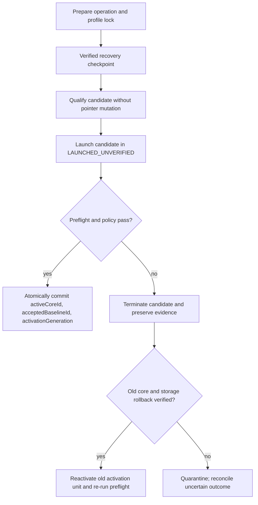

# Browser-Core Update Strategy

## Objective

Browser version may evolve while profile identity remains controlled. A new Camoufox release is never applied to every profile merely because it exists. Actual cross-version behavior is gated by `AUD-009` and rollback safety by `AUD-020`.

## User policies

- **Stable Automatic:** the system may migrate after artifact verification, compatibility qualification, and canary approval.
- **Manual Approval:** the system may download and qualify, but the user approves each migration.
- **Pinned:** the profile remains on the selected core until an explicit policy exception; security warnings remain visible.

Policy controls migration approval, not whether integrity checks run.

## Multi-core model

Multiple immutable core installations coexist. Each installation records engine, browser version, adapter compatibility, platform/architecture, artifact origin, hashes, signature result where available, install time, and qualification status. Profiles reference an installation; they do not depend on a mutable global binary path.

## Release pipeline

1. Discover metadata without activating it.
2. Download to an untrusted staging area.
3. Verify expected checksum and signature/provenance policy (`AUD-016`).
4. Ask the engine adapter to validate the staged candidate layout, compatibility, and launch prerequisites without installing it.
5. Let `core-updater` finalize the authorized candidate immutably alongside existing cores.
6. Run installation, launcher, contract, persistence, proxy, probe, and resource qualification.
7. Canary on disposable fixtures, then selected recoverable profiles.
8. Produce a semantic migration report.
9. Apply according to user policy.
10. Retain the prior core and recovery snapshot until rollback retention expires.

`core-updater` owns download, provenance authorization, installation finalization, catalogue state, and retention. The engine adapter supplies engine-specific validation only and cannot bypass artifact policy.

## Semantic fingerprint policy

Diffs are classified as:

- **Expected:** browser-version-derived values change within an approved rule.
- **Review required:** render-derived value changes within a tested but user-visible range.
- **Forbidden:** immutable identity changes, missing required surface, cross-context disagreement, unexplained proxy/network change, or unsupported fallback.

No concrete Camoufox rule is approved until the fingerprint inventory and migration experiment provide evidence (`AUD-001`, `AUD-003`, `AUD-009`, `AUD-019`, `AUD-022`).

## Atomicity and rollback

Before migration, create a safe checkpoint, persist the prior core/baseline pointers, and verify the old core remains launchable. Commit the new active core and accepted baseline only after the canary succeeds. On failure, terminate the new process, restore only if storage changed incompatibly, reactivate the old pointers, run preflight on the old core, and record the outcome.

Rollback must never silently downgrade storage that the old core cannot read. That compatibility is an explicit test result under `AUD-020`.

The activation unit follows the recommendation in [Data Authority](DATA_AUTHORITY.md) and [ADR-0015](adr/0015-profile-owned-active-core-pointer.md), which remain `Proposed`. Until approved, an implementation must not introduce a second mutable core pointer. Reconciliation compares the journaled intended generation with the authoritative profile record, baseline record, installed-core catalogue, checkpoint, and observed process tree; intent alone never completes a commit.

## Change isolation

A core migration does not simultaneously change proxy assignment, OS/device preset, profile secret, identity seeds, extension set, or unrelated application schema. Isolating change makes semantic diagnosis and rollback meaningful.

## Anti-tampering and downgrade

The updater rejects untrusted or mismatched artifacts and records provenance. Downgrade is allowed only by an explicit rollback or pinned-policy path whose compatibility is known; arbitrary version substitution is rejected. The exact trust roots and distribution mechanism remain subject to `AUD-016` and licensing to `AUD-015`.
