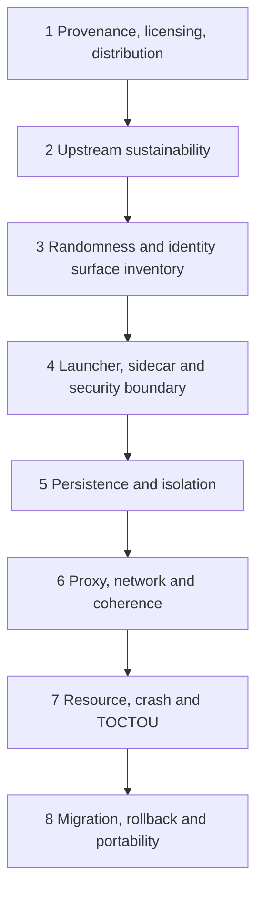

# Camoufox Audit Plan

- Status: Proposed; execution not authorized by this document
- Inputs: `UPSTREAM_LOCK.json` must be fully selected and reviewed before execution

## Fail-fast order

Stop or hold when a critical fail-fast result makes the selected distribution/engine path non-viable. Do not spend later-stage test effort to manufacture a GO around an unresolved earlier blocker.

## Workstreams

| Workstream | Audits | Required output |
|---|---|---|
| W1 Provenance/license | `AUD-015`, `AUD-016` | pinned source/artifact/dependency/license inventory and distribution constraints |
| W2 Sustainability | `AUD-023` | maintenance/governance/fork risk decision input |
| W3 Identity/surface inventory | `AUD-001`, `AUD-002`, `AUD-003`, `AUD-006`, `AUD-007`, `AUD-019`, `AUD-022`, `AUD-028`, `AUD-029`, `AUD-030` | source-to-surface map, probe coverage, host-dependence and semantic rules |
| W4 Launcher/sidecar/platform security | `AUD-012`, `AUD-018`, `AUD-024`, `AUD-031`, `AUD-033`, `AUD-034` | launcher parity, topology/transport/ownership, IPC/path/keychain threat evidence |
| W5 Persistence/isolation | `AUD-004`, `AUD-005`, `AUD-013` | state inventory, negative isolation, checkpoint/reconciliation table |
| W6 Proxy/network coherence | `AUD-008`, `AUD-027`, `AUD-028` | fail-closed routing, TLS/HTTP/header and locale/location coherence matrix |
| W7 Capacity/crash/preflight | `AUD-014`, `AUD-032` plus crash scope of `AUD-013`/`AUD-024` | concurrency envelope, TOCTOU/revalidation policy, fault matrix |
| W8 Migration/portability | `AUD-009`, `AUD-010`, `AUD-011`, `AUD-020`, `AUD-021`, `AUD-026` | core-pair rules, portability/data-sensitivity matrices, extension constraints |
| W9 Release/future engine | `AUD-017`, `AUD-025` | later-phase security-tool and independent Chromium decision inputs |

## Baseline audit mapping (AUD-001–AUD-025)

| Audit | Workstream | Dependencies | Earliest execution |
|---|---|---|---|
| `AUD-001` | W3 | W1 lock, W2 context | Source inventory before runtime randomness tests |
| `AUD-002` | W3 | `AUD-001`, probe draft | Repeated restart matrix |
| `AUD-003` | W3 | `AUD-001`, `AUD-019` | Cross-context probe |
| `AUD-004` | W5 | W4 launcher/process candidate | Multi-instance isolation |
| `AUD-005` | W5 | W4 lifecycle candidate | State/checkpoint inventory |
| `AUD-006` | W3 | environment/font fixtures | Host/font matrix |
| `AUD-007` | W3 | GPU environments and probe | GPU/WebGL matrix |
| `AUD-008` | W6 | W4 launcher config, controlled network | Proxy/leak matrix |
| `AUD-009` | W8 | two qualified core locks, W3 probe | Migration diff |
| `AUD-010` | W8 | W3 host rules, W5 state inventory | Cross-host portability |
| `AUD-011` | W8 | W5 state inventory | Extension matrix |
| `AUD-012` | W4 | W1 pins | TS/Python parity |
| `AUD-013` | W5/W7 | operations model, W4 process protocol | Fault injection |
| `AUD-014` | W7 | viable launcher/process topology | Resource benchmark |
| `AUD-015` | W1 | selected candidate locators | First fail-fast review |
| `AUD-016` | W1 | selected release/artifact channel | First fail-fast review |
| `AUD-017` | W9 | packaged/signed candidate exists | Phase 5 release matrix |
| `AUD-018` | W4 | local API/endpoint design exists | Design threat review then Phase 4 runtime test |
| `AUD-019` | W3 | source surface inventory | Coverage/mutation plan |
| `AUD-020` | W8 | two cores, verified snapshot | Rollback matrix |
| `AUD-021` | W8 | W5 state inventory, container design | Same-OS round trip |
| `AUD-022` | W3 | environment matrix, surface map | Host variance |
| `AUD-023` | W2 | W1 candidate ownership/history | Second fail-fast review |
| `AUD-024` | W4 | operations/process/topology proposals | Protocol/topology spike |
| `AUD-025` | W9 | Camoufox contract stabilized | Phase 5 independent spike |

`AUD-026` extends the original baseline with credential/session-boundary work. `AUD-027`–`AUD-034` make previously implicit blind spots independently traceable. They use the same evidence workflow and are not assumed complete.

## Execution package per audit

1. Copy the audit report/evidence templates.
2. Resolve the audit's upstream lock and environment IDs.
3. Pre-register hypothesis, expected result, stop criteria, fixtures, commands/config, redaction, and artifact retention.
4. Perform source review and runtime experiments as separate evidence sets.
5. Hash artifacts, record confounders and failed/inconclusive runs.
6. Obtain reviewer sign-off and recommend—but do not silently apply—a status/decision.

